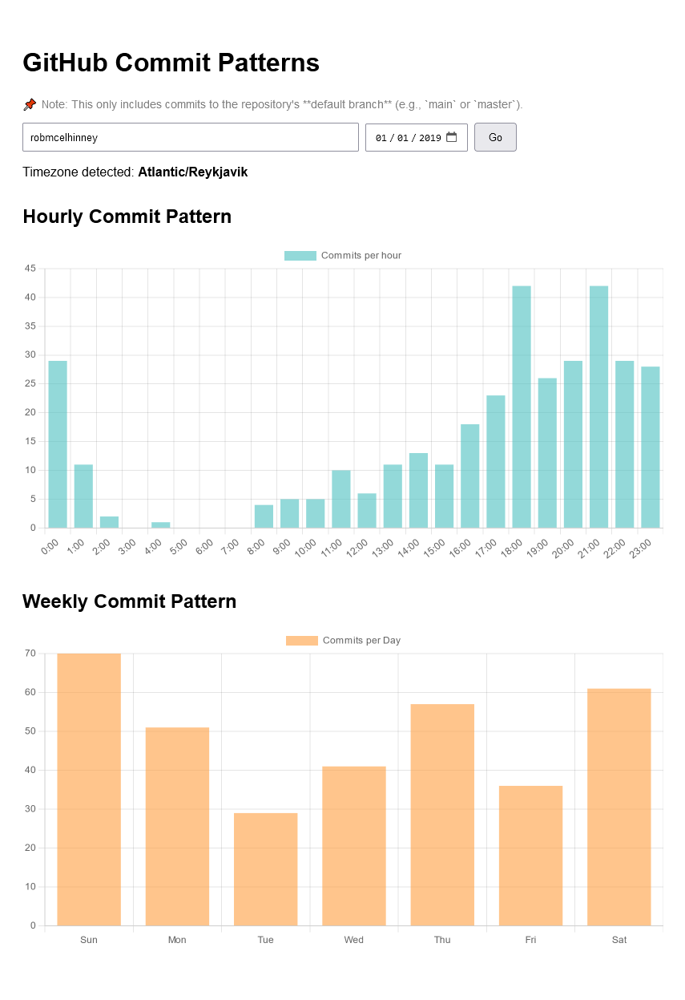

# **CodeTime 📊**

**CodeTime** is a web application that visualizes your GitHub activity based on **commit timestamps** to a repo's default branch. It helps you analyze when you're most active on GitHub and provides insights into your coding habits.

---

## **Features 🌟**

-   **Commit Heatmaps** – Visualize your GitHub commit patterns by hour and weekday.
-   **Timezone Aware** – Automatically converts commit times to your local timezone.
-   **Custom Date Range** – Analyze commits for any time period, defaulting to the past year.
-   **Fast Caching (Development Mode)** – Caches GitHub data locally to avoid hitting API limits.

---

## **Installation & Setup 🛠️**

1. **Clone the repository**:

    ```bash
    git clone https://github.com/robmcelhinney/codeTime.git
    cd codeTime
    ```

1. **Install dependencies**:

    ```bash
    npm install
    ```

1. **Run the development server**:

    ```bash
    npm run dev
    ```

    Open [http://localhost:3000](http://localhost:3000) in your browser.

1. **Build for production**:
    ```bash
    npm run build
    npm start
    ```

---

## **Usage 📖**

### **1️⃣ Enter Your GitHub Username**

-   Type your GitHub username into the input field.
-   Click **Go** to fetch your commit history.

### **2️⃣ Choose a Date Range**

-   Select a **start date** to analyze commits from that point onward.
-   Defaults to **1 year ago** if no date is selected.

### **3️⃣ View Commit Activity**

-   **Hourly Heatmap**: Displays commit frequency for each hour of the day.
-   **Weekday Heatmap**: Shows which days you commit the most.

---

## **API & Caching 🔥**

The project fetches commit data using the **GitHub Search API**. To avoid hitting API limits, commits are **cached locally in development mode**.

-   **Cache Enabled (`USE_CACHE=true`)** → Saves commit data in the `cache/` directory.
-   **Cache Disabled (`USE_CACHE=false`)** → Always fetches fresh data from GitHub.

You can manually delete cache files in the `cache/` folder if needed.

---

## **Development 🧑‍💻**

### **Code Structure**

-   **`pages/`** – Next.js pages, including `/api/github.js` for backend API requests.
-   **`components/`** – React components for charts and UI elements.
-   **`cache/`** – Stores cached GitHub data (used in development mode).

---

## Screenshot



---

## **License 📜**

This project is licensed under the **MIT License**.
